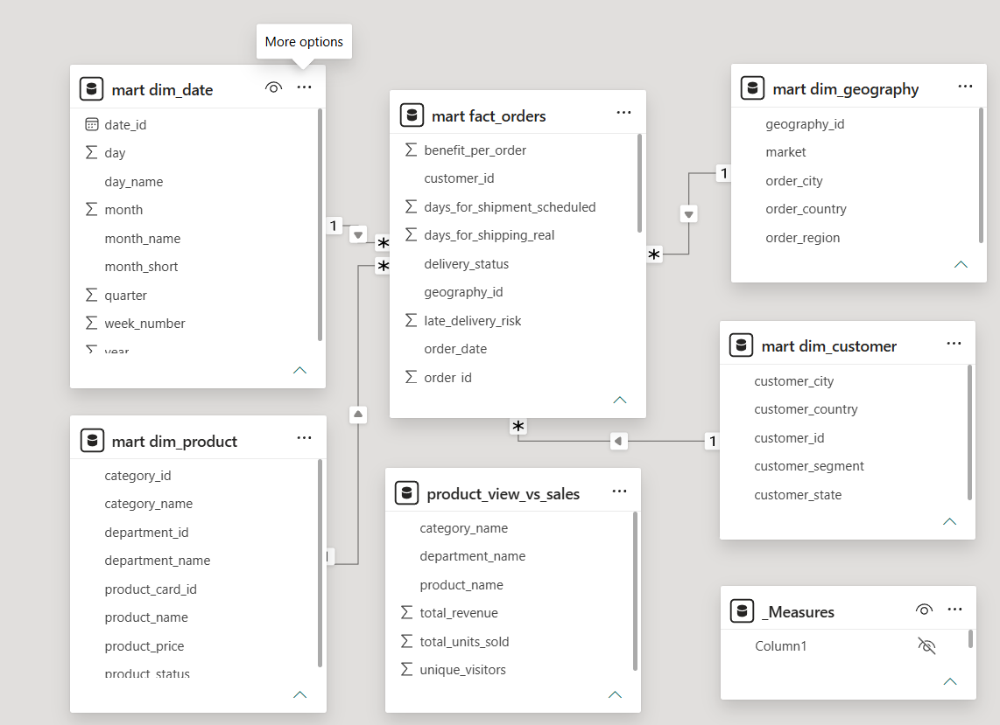
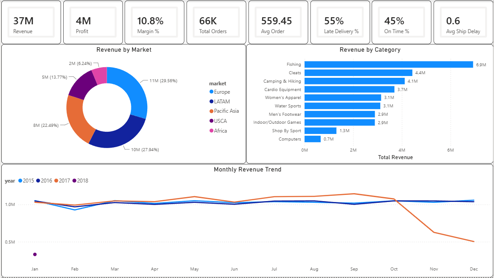
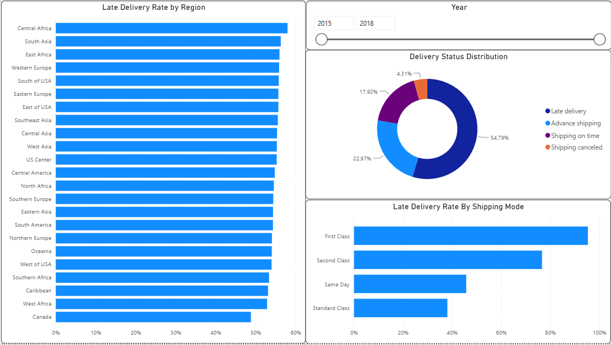
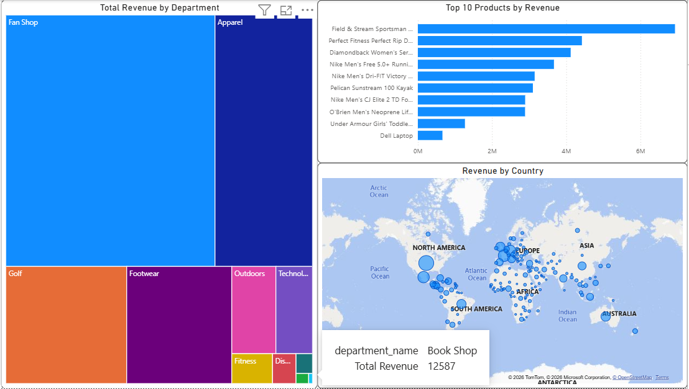
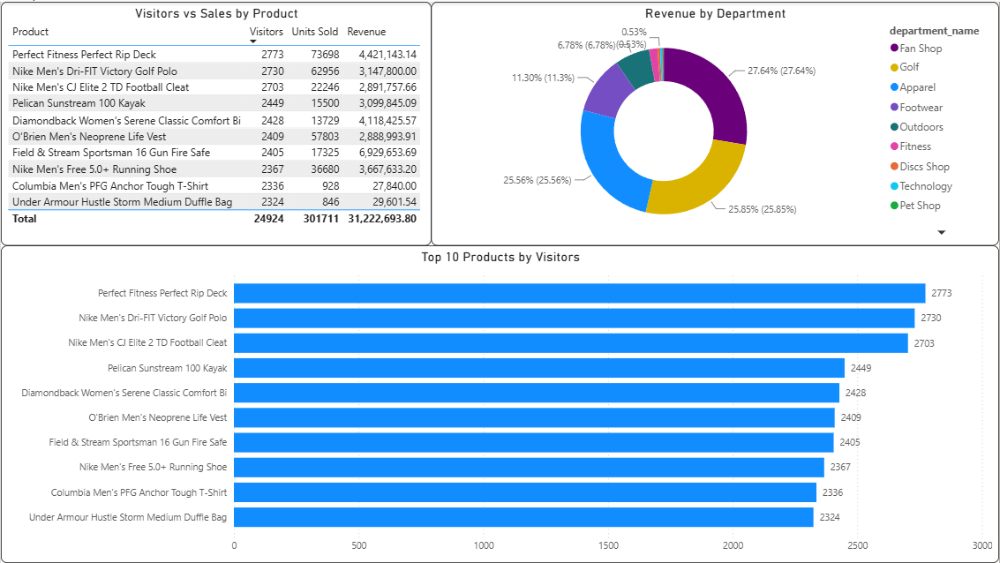

# Supply Chain Analysis — SQL ETL Pipeline + Power BI Dashboard
**Tools:** PostgreSQL · Power BI | **Data Source:** DataCo Global Supply Chain Dataset + Webshop Access Logs | **Rows:** 180,519 orders + 469,977 access log events
 
## Project Overview
This project builds a full ETL pipeline in PostgreSQL and connects it to a Power BI dashboard for visualization. It is the second part of a two-project supply chain series — where the first project used Power Query for data transformation, this project moves the entire ETL process to SQL, following a real-world layered architecture.
 
The analysis answers four core business questions:
- **Where is the money coming from?** — Revenue by category, product, market, and department
- **Are shipments arriving on time?** — Late delivery rates by region and shipping mode
- **Which products and markets drive growth?** — Top performers and geographic distribution
- **Which products attract visitors but fail to convert?** — Webshop traffic vs actual sales
---
 
## Dataset
- **Source:** [DataCo SMART SUPPLY CHAIN FOR BIG DATA ANALYSIS](https://www.kaggle.com/datasets/shashwatwork/dataco-global-supply-chain-dataset)
- **Orders dataset:** 180,519 rows × 53 columns
- **Access logs dataset:** 469,977 rows × 8 columns
- **Period:** 2015–2018
---
 
## Architecture — Three-Layer Design
 
```
Raw CSV files
     │
     ▼
┌─────────────────────────────────┐
│         STAGING LAYER           │
│  staging.stg_orders             │  ← Raw data, all TEXT types
│  staging.stg_access_logs        │
└─────────────────────────────────┘
     │
     ▼
┌─────────────────────────────────┐
│          CLEAN LAYER            │
│  clean.orders                   │  ← Type casting, date conversion
│  clean.access_logs              │     TRIM, validated data
└─────────────────────────────────┘
     │
     ▼
┌─────────────────────────────────┐
│          MART LAYER             │
│  mart.fact_orders               │  ← Star schema with PK/FK
│  mart.dim_customer              │     constraints
│  mart.dim_product               │
│  mart.dim_geography             │
│  mart.dim_date                  │
│  mart.product_view_vs_sales     │  ← Materialized view joining
└─────────────────────────────────┘     orders + access logs
     │
     ▼
Power BI Dashboard (PostgreSQL connector)
```
 
---
 
## Data Model — Star Schema

 
```
mart.fact_orders (180,519 rows)
    ├── mart.dim_customer    (20,652 rows)  — customer_id
    ├── mart.dim_product     (118 rows)     — product_card_id
    ├── mart.dim_geography   (3,716 rows)   — geography_id (surrogate key)
    └── mart.dim_date        (1,461 rows)   — order_date
```
 
**Key design decisions:**
- **Three-schema architecture** (`staging` → `clean` → `mart`) mirrors production data warehouse patterns
- **Staging layer** stores all columns as `TEXT` to avoid import errors — type casting happens in the clean layer
- **Surrogate key** for `dim_geography` generated using `ROW_NUMBER() OVER()` since no natural single-column key existed
- **Dim_date** generated using `generate_series()` to enable time-based analysis
- **Materialized view** (`product_view_vs_sales`) pre-aggregates the join between access logs and orders using CTEs — reducing query time from several minutes to ~3 seconds
- **Primary and foreign key constraints** defined on all mart tables for data integrity
---
 
## Key SQL Techniques Used
| Technique | Where Used |
|---|---|
| `COPY` / pgAdmin Import | Staging data ingestion |
| `TO_DATE()` with format mask | Date conversion in clean layer |
| `LOWER(TRIM())` | Fuzzy product name matching |
| `ROW_NUMBER() OVER()` | Surrogate key generation |
| `generate_series()` | Date dimension table |
| `COALESCE()` | Null handling in materialized view |
| CTEs | Pre-aggregation before joining |
| `CREATE MATERIALIZED VIEW` | Performance optimization |
| PK/FK constraints | Data integrity in mart layer |
 
---
 
## DAX Measures (Power BI)
| Measure | Formula Logic |
|---|---|
| `Total Revenue` | SUM of sales |
| `Total Profit` | SUM of order profit |
| `Profit Margin %` | Total Profit / Total Revenue |
| `Total Orders` | DISTINCTCOUNT of order_id |
| `Avg Order Value` | Total Revenue / Total Orders |
| `Late Delivery Rate %` | Orders with late_delivery_risk = 1 / Total orders |
| `On Time Delivery Rate %` | 1 - Late Delivery Rate % |
| `Avg Shipping Delay` | AVG(days_shipping_real) - AVG(days_shipping_scheduled) |
 
---
 
## Dashboard — 4 Pages
 
### 1. Executive Overview

 
### 2. Shipping Performance

 
### 3. Product & Market Analysis

 
### 4. Product Insights *(new — powered by materialized view)*

 
Combines webshop access logs with order data to identify high-traffic, low-conversion products — actionable insights for marketing optimization.
 
---
 
## Key Insights
- **54.8% of shipments are late** — more than half of all orders experience delivery delays
- **First Class has the highest late delivery rate (~80%)** — tighter promised windows mean more misses
- **Fan Shop dominates revenue ($17M out of $37M total)** — heavy dependency on a single department
- **Europe is the largest market (29.56%)** followed closely by LATAM (27.94%)
- **Columbia Men's PFG and Under Armour Duffle Bag** attract 2,300+ visitors each but generate under $30K in revenue — high traffic, low conversion products worth investigating
---
 
## Tools & Skills Used
- **PostgreSQL 17** — staging, cleaning, star schema, materialized views
- **pgAdmin** — database management, CSV import
- **Power BI Desktop** — data modeling, DAX, dashboard design
- **Power Query** — minor transformations after PostgreSQL connection
- **DAX** — calculated measures
---
 
## Project Structure
```
supply-chain-sql-powerbi/
│
├── README.md
├── sql/
│   ├── 01_staging.sql
│   ├── 02_clean.sql
│   ├── 03_mart.sql
│   └── 04_materialized_view.sql
├── supply_chain_sql.pbix
└── screenshots/
    ├── data_model.png
    ├── executive_overview.png
    ├── shipping_performance.png
    ├── product_market_analysis.png
    └── product_insights.png
```
 
---
 
## How to Use
1. Download the datasets from [Kaggle](https://www.kaggle.com/datasets/shashwatwork/dataco-global-supply-chain-dataset)
2. Create a PostgreSQL database: `CREATE DATABASE supply_chain;`
3. Run the SQL scripts in order: `01_staging.sql` → `02_clean.sql` → `03_mart.sql` → `04_materialized_view.sql`
4. Open `supply_chain_sql.pbix` in Power BI Desktop
5. Update the PostgreSQL connection: **Transform Data** → **Data source settings** → update server/credentials
6. Click **Refresh**
---
 
*This is Part 2 of a two-project supply chain portfolio series. [Part 1 — Power BI only pipeline](https://github.com/ilyesklara/supply-chain-powerbi)*
